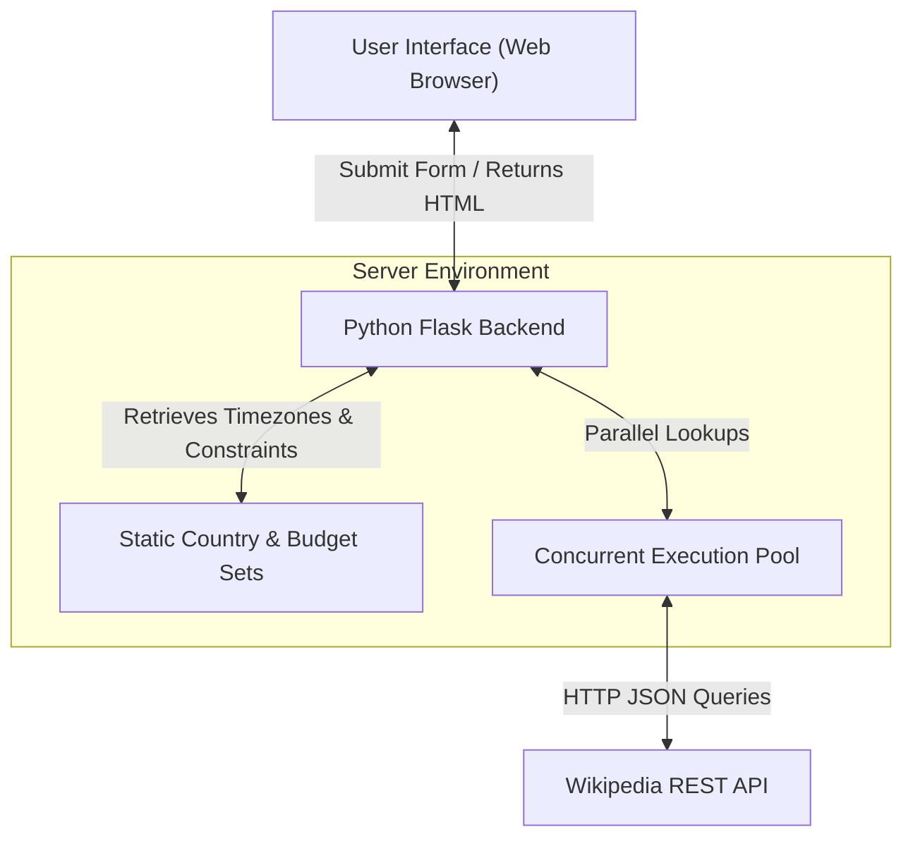
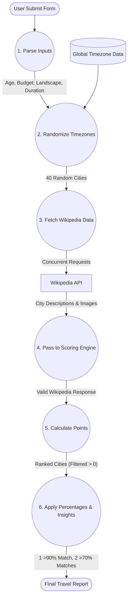
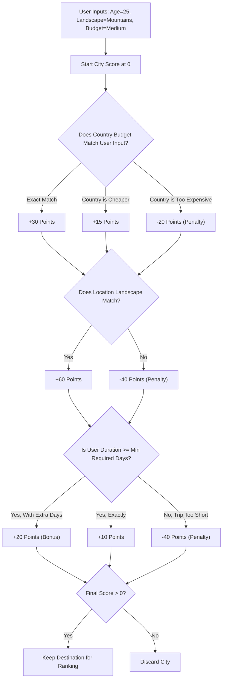

# System Architecture

This document outlines the high-level architecture, data movement, and decision logic that powers the Travel Suggestion application.

## 1. Architecture Diagram
This diagram shows the basic structure of the client-server relationship and external data sources.

## 2. Data Flow Diagram (DFD)
This diagram details how the user's input flows through the internal functions to eventually generate the top three travel outputs.

## 3. Decision Logic Diagram
This diagram shows the core heuristic engine: how points are strictly added or subtracted based on whether a city meets the user's constraints.

