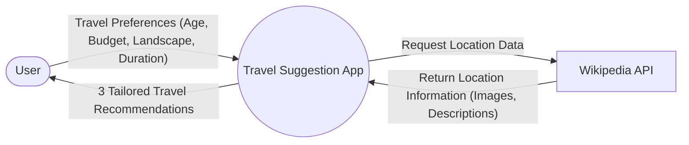
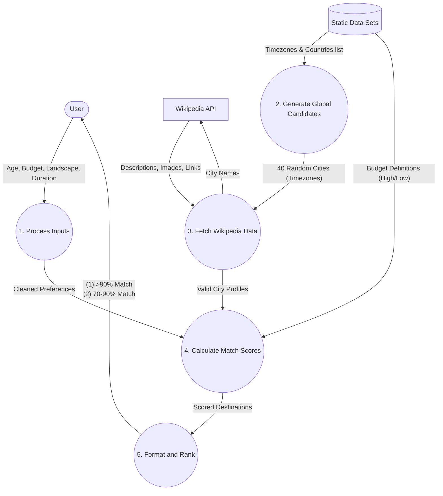

# Data Flow Diagram (DFD)

This document contains the Data Flow Diagrams defining how data moves through the Travel Suggestion application.

## Level 0 DFD (Context Diagram)
This shows the highest level view of the system, illustrating how the user interacts with the app as a whole.

## Level 1 DFD (Process Level)
This breaks down the main system into detailed internal processes, showing step-by-step how the data is transformed to generate the suggestions.

### Process Explanations
- **1. Process Inputs**: Receives the form submission from the user and prepares it for calculation.
- **2. Generate Global Candidates**: Grabs a randomized chunk of exactly 40 global timezones to ensure the app gives different possible results every single time.
- **3. Fetch Wikipedia Data**: Speaks to Wikipedia using the 40 random cities simultaneously (Concurrent futures) to get their pictures and real-world monument names.
- **4. Calculate Match Scores**: Compares the user's Preferences (from Step 1) against the downloaded valid cities (from Step 3) using a strict points system (e.g., matching the budget, checking duration limits).
- **5. Format and Rank**: Takes the highest scoring locations, locks the top result to an overt 90%+ match and strings together the final custom pitches before sending them back to the user's screen.
